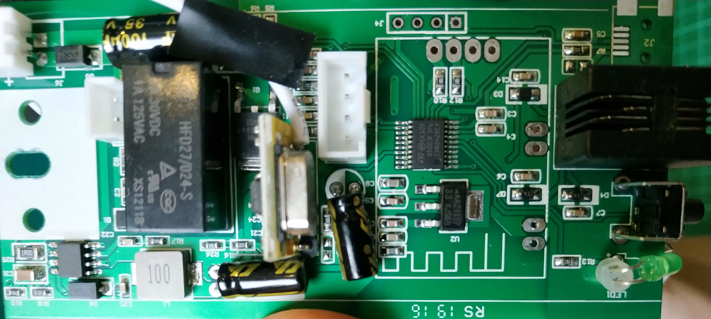

## ESPTool Outputs

Image_info:

```text
    esptool.py v2.5.0
    Image version: 1
    Entry point: 4010057c
    3 segments
    Segment 1: len 0x00a20 load 0x40100000 file_offs 0x00000008
    Segment 2: len 0x002fc load 0x3ffe8000 file_offs 0x00000a30
    Segment 3: len 0x002a4 load 0x3ffe82fc file_offs 0x00000d34
    Checksum: 22 (valid)
```

Chip_ID

```text
    esptool.py v2.5.0
    Found 2 serial ports
    Serial port /dev/ttyUSB0
    Connecting....
    Detecting chip type... ESP8266
    Chip is ESP8266EX
    Features: WiFi
    MAC: xx:xx:xx:xx:xx
    Uploading stub...
    Running stub...
    Stub running...
    Chip ID: 0x00a6aa51
    Hard resetting via RTS pin...
```

flash_id
```text
    esptool.py v2.5.0
    Found 2 serial ports
    Serial port /dev/ttyUSB0
    Connecting....
    Detecting chip type... ESP8266
    Chip is ESP8266EX
    Features: WiFi
    MAC: xx:xx:xx:xx:xx
    Uploading stub...
    Running stub...
    Stub running...
    Manufacturer: c8
    Device: 4014
    Detected flash size: 1MB
    Hard resetting via RTS pin...
```

## Images of board





## Communications notes

1. Looks like the ESP talks to STM8S003F3 via Serial
